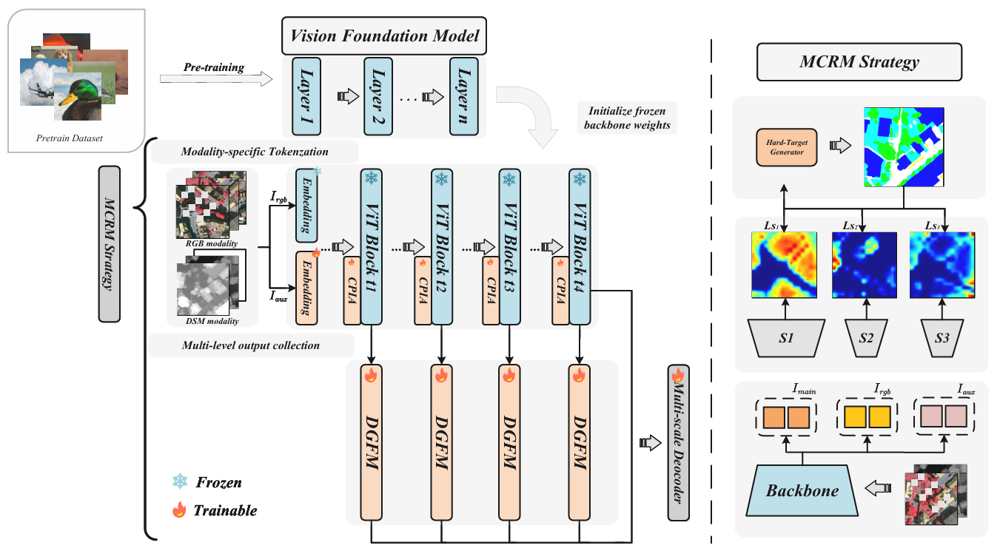
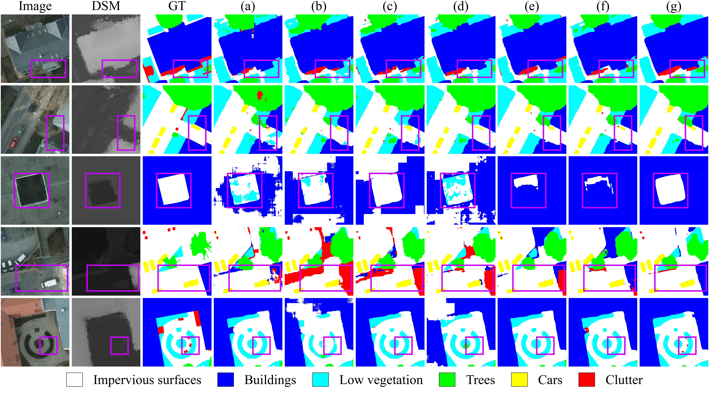
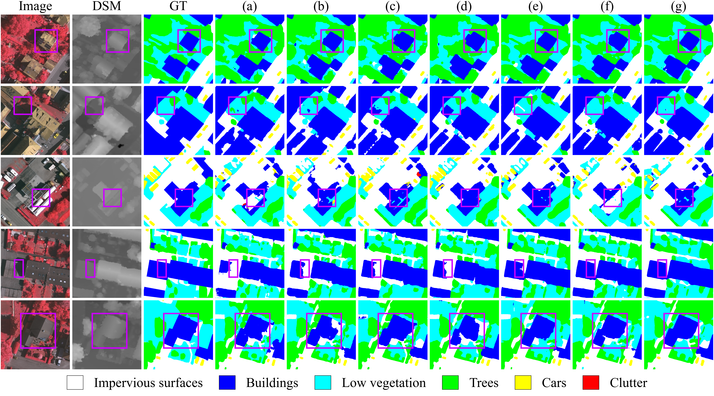

# MoBaNet

**MoBaNet**: Parameter-Efficient Modality-Balanced Symmetric Fusion for Multimodal Remote Sensing Semantic Segmentation  
[Paper on arXiv](https://arxiv.org/abs/2603.17705)

MoBaNet is a multimodal remote sensing semantic segmentation framework for RGB and DSM data. This repository is designed for the ISPRS Vaihingen and Potsdam benchmarks, with a DINOv2- or SAM-based encoder and a lightweight multimodal fusion pipeline for better cross-modal interaction and boundary-aware prediction.

## Overview

The repository includes:

- training and testing code
- model definitions and encoder implementations
- local DINOv2 hub code
- framework and qualitative comparison figures

MoBaNet takes two input modalities:

- RGB aerial images
- DSM elevation maps

The main components are:

- `CPIA` for cross-modal prompt interaction
- `dgfm` for boundary-aware gated fusion
- `MCRC` for local cross-modal region corruption during training
- `UPerNetHead` for multi-scale decoding

## Framework

<p align="center">
  
</p>

The original PDF version is available at [figure/overall.pdf](figure/overall.pdf).

## Repository Structure

```text
MoBaNet/
|- Net.py
|- Net_heatmap.py
|- train.py
|- test_heatmap.py
|- utils.py
|- Model/
|  |- cfg.py
|  `- models/
|- dinov2_hub/
`- figure/
   |- overall.pdf
   |- overall.png
   |- potsdam_compare_patch512.pdf
   |- potsdam.png
   |- vaihingen_compare_patch512.pdf
   `- vaihingen.png
```

## Environment

Recommended environment:

- Python 3.10+
- PyTorch
- torchvision
- numpy
- opencv-python
- scikit-image
- scikit-learn
- matplotlib
- tqdm
- pillow
- IPython

If you use the DINOv2 encoder, prepare the local `dinov2_hub` code and the corresponding pretrained checkpoint in advance.

## Data Preparation

This project is built for the ISPRS 2D Semantic Labeling datasets:

- Vaihingen
- Potsdam

The dataset path and the active dataset are currently defined in `utils.py`.

You should update the following fields before training:

1. Dataset root path

```python
FOLDER = "/path/to/your/dataset/"
```

2. Active dataset

```python
# DATASET = 'Vaihingen'
DATASET = 'Potsdam'
```

3. GPU device

```python
os.environ["CUDA_VISIBLE_DEVICES"] = "0"
```

## Pretrained Weights

The project supports both `DINOv2` and `SAM` encoders. The main configuration is defined in `Model/cfg.py`, including:

- `-encoder`
- `-dinov2_ckpt`
- `-dinov2_hub_dir`
- `-sam_ckpt`
- `-weights`

Update these paths to match your local environment. For example:

```python
parser.add_argument('-dinov2_ckpt', default='/path/to/dinov2_checkpoint.pth')
parser.add_argument('-dinov2_hub_dir', default='dinov2_hub')
parser.add_argument('-weights', default='/path/to/your_trained_checkpoint.pth')
```

## Training

Example training command:

```bash
python train.py -mode Train -encoder dinov2_vitl14
```

To explicitly enable the main multimodal modules:

```bash
python train.py -mode Train -encoder dinov2_vitl14 -use_cpia True -use_dgfm True -mcrc True
```

Checkpoints are saved automatically to:

- `resultsp/` for Potsdam
- `resultsv/` for Vaihingen

## Testing

Example testing command:

```bash
python train.py -mode Test -encoder dinov2_vitl14 -weights /path/to/checkpoint.pth
```

The script reports `mIoU` and saves colorized prediction maps to the corresponding result directory.

## Visualization Results

### Potsdam

<p align="center">
  
</p>

### Vaihingen

<p align="center">
  
</p>

## Citation

If you use this repository in your research, please cite the associated paper once the bibliographic information is finalized.

```bibtex
@article{mobanet,
  title={Parameter-Efficient Modality-Balanced Symmetric Fusion for Multimodal Remote Sensing Semantic Segmentation},
  author={Li, Haocheng and Zheng, Juepeng and Miao, Shuangxi and Lu, Ruibo and Cai, Guosheng and Fu, Haohuan and Huang, Jianxi},
  journal={arXiv preprint arXiv:2603.17705},
  year={2026},
  doi={10.48550/arXiv.2603.17705}
}
```
